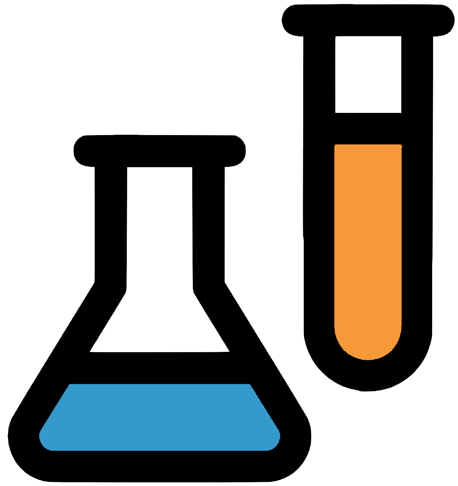

# Scikit Lab
This project is an evolving python library of custom & meta [scikit-learn](https://scikit-learn.org/stable/)
components for various domains.

## Project Goals

✅ **Centralized Dependency**<br>
Have a single project dependency integrating with the various other libraries in the scikit-learn ecosystem.

✅ **Rich Domain Features**<br>
Provide ready-to-use signals for common real-world scenarios (ie: spatial, temporal, textual, ..)

✅ **Streamline End-to-End Pipelines**<br>
From experimentation to deployment ensure data-preprocessing, sampling & sub-model assumptions hold throughout.


## Installation
Until this project gets an official [PyPi](https://pypi.org) package,
it can be used with your favorite tools as follows:

**package manager**
```shell
pip install -e "git+https://github.com/eangius/scikit-lab.git#egg=scikitlab";
```

**requirements file**
```requirements.txt
-e "git+https://github.com/eangius/scikit-lab.git#egg=scikitlab"
```

!!! Warning
	Since this project is currently experimental,
	it is recommended to install from explicit commit hashes
	to ensure behaviour remains stable.
